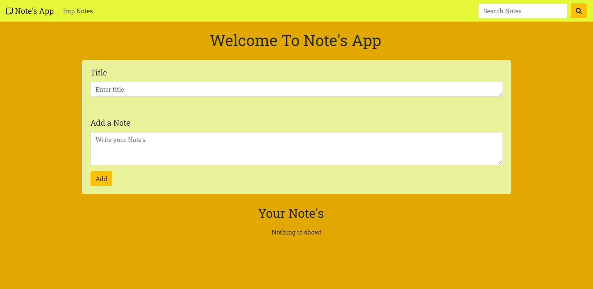
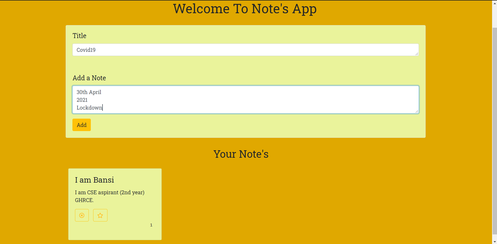
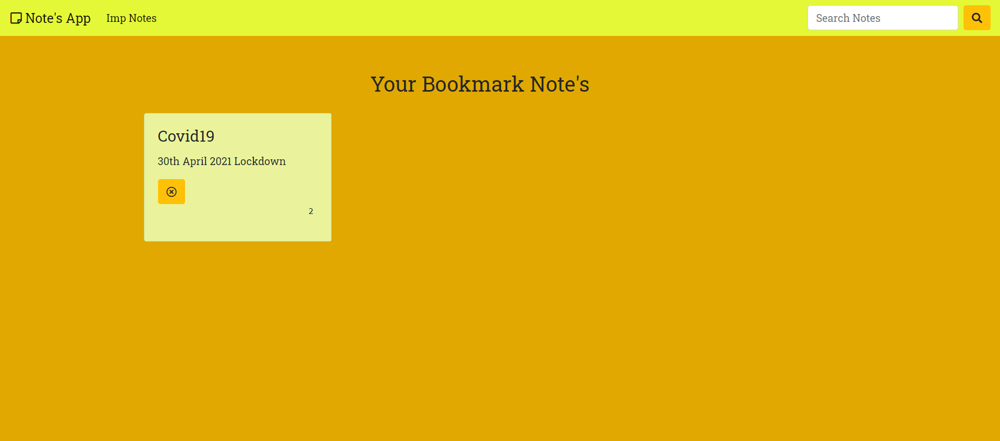
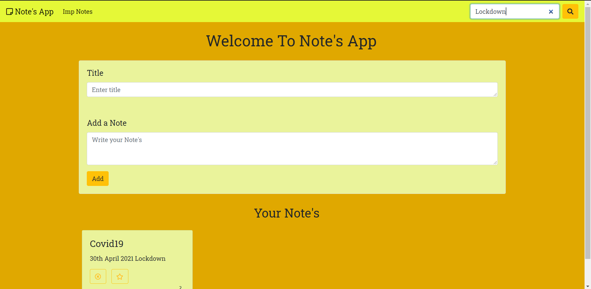

# Notes App with pure JavaScript
## Plus userfriendly and compatible in mobile phones.
#### Git Hub website: [Notes App](github.com/bansi32/notesapp.git)
### Reference : Code With Harry
**1. Home Page:**

```
   It contains add a note button, search bar, 
   link to Imp/Bookmark notes, 
   delete button and bookmark button.
```


**2. AddButton:**

```
   It will add a note to home page with
   a page number marked at the bottom
   of the note.
```


**3. Notes Marked Important**

```
   It will add a note that you bookmarked 
   to Imp Notes page with a page number 
   marked at the bottom of the note.
```



**4. Search Bar**

```
   It will help you to search for 
   the note. You can type a particular 
   letter or word on the search bar
   and find your note.
```


